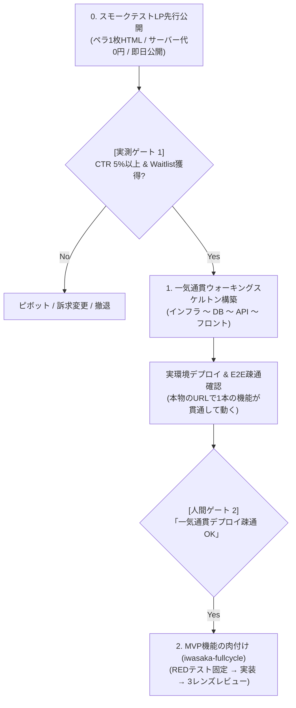

# iwasaka-greenfield（0→1 新規立ち上げスキル）

「コードを書く前に需要を実測し、コードを書くときはインフラからフロントまで一気通貫で疎通させる」ゼロイチ開発の標準手順です。

## 🎯 2大コアコンセプト

1. **LP先行公開（Pretotyping / Fake Door Test）**:
   - 「欲しいですか？」とアンケートを取るな、行動を実測せよ。
   - ペラ1枚の完成度高いランディングページを即日公開し、CTAクリック率（CTR）とWaitlist登録数で「本当に作る価値があるか」を実測する。
2. **一気通貫ウォーキングスケルトン（End-to-End Vertical Slice）**:
   - ローカルの骨組みだけで満足しない。
   - **「フロントエンド ＋ バックエンドAPI ＋ データベース ＋ デプロイインフラ（IaC/ホスティング）」** の全層を貫く極小の動くシステムを実際にデプロイし、実URL・実環境で疎通を確認する。

---

## 🚀 全体ライフサイクル

---

## 詳細手順

### フェーズ 0: スモークテストLP先行公開（需要の実測検証）

1. **バリュープロポジション策定**:
   - サブエージェント `iwasaka-product` が「鋭利なペイン3選」「1行の解決策」「コアベネフィット」を定義。
2. **ペラ1枚LPの生成（Zero Infrastructure）**:
   - サーバー代0円、DB不要。Tailwind CSS (CDN) + Lucide Icons で完結する単一の `index.html` を作成。
   - **Fake Door モーダル**: CTAボタンクリック時に「先行ベータ版準備中」を案内し、Formspree / Tally / Google Form 経由でメールアドレスを回収。
3. **即時デプロイ**:
   - GitHub Pages, Vercel, Netlify, Cloudflare Pages のいずれかに即日公開。
4. **実測判定（Go / No-Go Criteria）**:
   - 100〜300ユニーク訪問者を流し、以下で判定：
     - **CTR 5%以上 / メールCVR 3%以上**: **合格（強い需要あり）** ➔ フェーズ1へ着工。
     - **CTR 2%未満**: **需要なし** ➔ コピー・訴求を見直すか撤退。

---

### フェーズ 1: 一気通貫ウォーキングスケルトン（Vertical Slice）

需要が実測されたら、アーキテクチャの端から端までを一気通貫で疎通させます。

1. **スタック選定**:
   - 退屈で堅牢なスタックを選ぶ（Next.js, NestJS, Prisma, PostgreSQL, Docker, AWS/Vercel/Fly.io等）。
   - 正本（SSOT）となる型定義・スキーマ配置場所を決定。
2. **全層の実装（Vertical Slice）**:
   - 画面1つ、APIエンドポイント1つ、DBテーブル1つ、インフラ構成1つ。
   - 例: 「画面からテキストを入力して保存ボタンを押すと、APIを経由して実DBに保存され、画面一覧に再描画される」。
   - ロジックは最小限にし、不要な中間層・過剰な抽象化は排す（150行程度なら1ファイル）。
3. **実インフラへのデプロイ**:
   - ローカル完結ではなく、ステージング環境または本番環境へ実際にデプロイする（IaCまたはCDパイプライン稼働）。
4. **実URLでの疎通実証**:
   - 実際のドメイン・URLでブラウザからアクセスし、エンドツーエンドでデータが流れることを実測。
5. **人間承認ゲート**:
   - ユーザーにURLを提示し、実機で確認いただく。
   - 承認合言葉: **「一気通貫デプロイ疎通OK」**（または「骨組みOK」）。

---

### フェーズ 2: MVP機能の肉付け（iwasaka-fullcycle）

一気通貫のパイプラインが通った後は、通常の `iwasaka-fullcycle` に移行します：
1. `iwasaka-red-tester`: 仕様の穴・境界値・認可境界を突く失敗テスト（RED）をロック。
2. GREEN実装: 製品コードを書き、全テストをパス。
3. `iwasaka-reviewer`: 3レンズ（正しさ、認可・テナント境界、API契約）で独立レビュー。
4. `iwasaka-ship-gate`: 出荷ゲートを完走し、PR・Done化。
