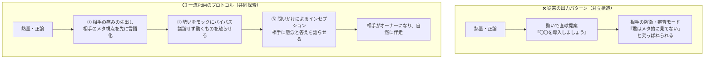

> [!summary] TL;DR
> 性格（熱量・探究心）を変えるのではなく、出力インターフェース（発言プロトコル）を切り替える。
> 提案の第一声で相手の制約・重圧（相手のメタ視点）を代弁して意思決定コストを引き受け、議論で論破する代わりに「動くモック（Show, Don't Tell）」を差し出して共同検証に持ち込む。
> アイデアの親権（クレジット）は相手に譲り、実装とスピードの主導権を握る。

## いつ発動するか

上位者（CTO・VPoE・経営層・事業部長）、20歳以上年上のステークホルダー、顧客、または不確実性の高いプロジェクトで新技術（AIエージェント、新アーキテクチャ等）や方針転換を提案・合意形成するとき。

## 手順・順番（3大出力プロトコル）

### 1. 相手の痛みの先出し（メタ視点の先制証明）
提案の第一声で、相手が背負っている責任・制約・重圧を先に自分の口から言語化する。
- **キラーフレーズ**: 「〇〇さん、既存の安定稼働とリソース逼迫が最優先の局面で、新技術を入れるリスクが高いのは重々承知の上なんですが……」
- **効果**: 相手は「こいつは全体（事業・運用・リスク）が見えている＝メタ的に考えている」と瞬時に認識し、審査官・防衛モードから「相談相手モード」へ軟化する。

### 2. 口の勢いを「動くモック」へバイパス（Show, Don't Tell）
議論で畳み掛けるのをぐっと堪え、熱量を手元のコード・プロトタイプ作成へ振り向ける。
- **キラーフレーズ**: 「言葉で説明するより触ってもらった方が早いと思って、手元で動く骨格だけ組んでみました。ダメ出しをもらえますか？」
- **効果**: 正論の議論は「勝ち負け（対立）」を生むが、動くモノは「共同検証（画面を一緒に覗き込む仲間）」を生む。ベテランエンジニアほど、動くものを前にすると少年（好奇心旺盛な開発者）に戻る。

### 3. 問いかけによるインセプション（相手を主役にする）
結論を押し付けず、相手の経験をリスペクトして懸念と答えを相手自身の口から語らせる。
- **キラーフレーズ**: 「もし仮にこの技術を一部だけ試すとしたら、〇〇さんの視点から見て最大の地雷やボトルネックってどこになりそうですかね？」
- **効果**: 相手のプライドを守りながら課題を特定し、「じゃあその地雷を回避する検証をやってきます」と相手の意思決定の味方になれる。

---

## konifarの3大チェックリスト（提案前のセルフレビュー）

提案が通らないとき、相手の頑固さではなく自分のコントロール可能領域を疑う。

| チェック項目 | 陥りがちな甘さ | 修正アクション |
| :--- | :--- | :--- |
| **① 提案は浅くないか？** （思考の丸投げ） | 「〇〇ツールを使いましょう」と手段だけ投げ、タイミング・コスト・リスク・影響調査など一番重い意思決定を相手に丸投げしていないか？ | 懸念されるリスクA/Bの緩和策、既存システムとの境界線、ロールバック計画まで調べ尽くし、相手が「Yes」と判子を押すだけの状態まで思考を深めて持参する。 |
| **② 伝え方は順序を守っているか？** （前提の不一致） | 課題認識が揃っていないのに、いきなり結論・手段をぶつけていないか？ | ①課題認識 ➔ ②目指す状態 ➔ ③ギャップ ➔ ④選択肢（新技術はその1つ）の順で階段を一段ずつ登る。 |
| **③ 信用（安心感）はあるか？** （自己顕示と覚悟） | 「新しい技術を知っている優秀な自分」を認めてほしいという承認欲求や見栄が透けていないか？ | 自己顕示欲を手放し、相手の事業責任に寄り添う。「失敗した時に最後まで泥をかぶる覚悟」を行動と動くプロトタイプで示す。 |

---

## クレジット譲渡と主導権獲得の作法（Inception & Execution Control）

自分が提案した時は反応が薄かったのに、1〜2週間後に相手が「〇〇を導入するぞ！」と言い出した時の3つのレベル：

| レベル | リアクション | 結果 |
| :--- | :--- | :--- |
| **三流** | 「それ、前に私が言いましたよね？（言ったじゃん）」 | 相手のプライドを粉砕し、心理的敵対関係になる。最悪の手。 |
| **二流** | 「伝わったなら良かったです（静観・傍観）」 | 衝突は避けるが、主導権を完全に手放し、指示待ち作業員に後退する。 |
| **一流（総料理長PdM）** | **「クレジット（名誉）は相手に譲り、エグゼキューション（実行・主導権）を奪う」** | **「〇〇さん、それ最高ですね！前回の議論から私もずっと考えていて、実は手元に動く骨格があります。これベースで最速で進めましょう！」**と即座に燃料を投下し、プロジェクトのハンドルを握る。 |

---

## 落とし穴・避けていること

- **正論で論破しようとすること**: 正論は切れ味の鋭いナイフであり、相手の逃げ道を塞ぐ。プライドを傷つけられた相手は防衛のために「君はメタ的に見ていない」と反論してくる。
- **相手のメタ視点を無視してツールだけ推すこと**: 経営層やマネジメント層にとってのメタは「会社のリソース・事業リスク・既存運用の安定」。そこへの解像度を示さずに語る技術論は「視野が狭い」と判定される。
- **不満を居酒屋の愚痴で終わらせること**: 「わかってくれない」と嘆くのではなく、「どうすれば自然に伴走させられたか」と矢印を自分に向け、プロトコルとして蒸留する。

---

## 関連

- [[iwasaka-brain/principles/communication-and-reporting|報告・共有・レビュー依頼の原則]]
- [[iwasaka-brain/principles/evidence-over-claims|実測を信じる]]
- [[iwasaka-brain/principles/scope-control|スコープの切り方]]
- [[iwasaka-brain/patterns/how-i-ask|依頼の出し方の型]]
